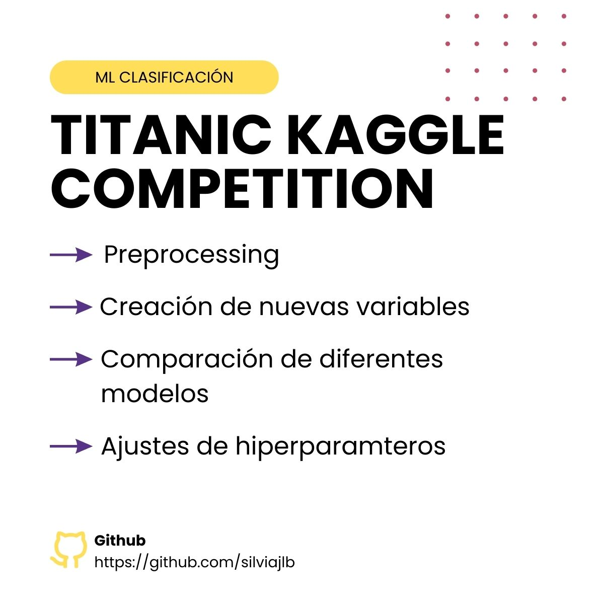

**Título del Proyecto:**
Predicción de Supervivientes del Titanic mediante Machine Learning

**Descripción:**
Este proyecto de Machine Learning se centra en la predicción de la supervivencia de pasajeros a bordo del Titanic utilizando técnicas de aprendizaje automático. A través del análisis exhaustivo de datos y la implementación de diversos algoritmos de clasificación, se ha desarrollado un modelo predictivo preciso y confiable.

**Pasos Realizados:**
1. **Exploración de Datos:** Se realizaron análisis preliminares sobre el conjunto de datos del Titanic para comprender la naturaleza de los atributos y la distribución de los datos.
  
2. **Preprocesamiento de Datos:** Se llevaron a cabo varias etapas de preprocesamiento, incluyendo la eliminación de registros duplicados, manejo de valores nulos e imputación de outliers. Además, se realizó una limpieza exhaustiva para corregir errores tipográficos y tipos de datos incorrectos.
  
3. **Feature Engineering:** Se generaron nuevas variables derivadas de las características existentes para identificar posibles predictores significativos de la supervivencia.
  
4. **Codificación y Selección de Características:** Se implementó la codificación one-hot y se eliminaron características altamente correlacionadas y aquellas con baja varianza para mejorar la calidad de los datos.
  
5. **Modelado:** Se entrenaron varios algoritmos de clasificación, como Logistic Regression, RandomForestClassifier, XGBClassifier, LGBMClassifier y KNeighborsClassifier. Se evaluó la capacidad predictiva de cada modelo utilizando métricas como AUC Train y AUC Cross-Validation.
  
6. **Optimización de Hiperparámetros:** Se optimizaron los hiperparámetros del modelo RandomForestClassifier, como 'max_depth', 'num_leaves', 'learning_rate', 'reg_alpha', 'reg_lambda' y 'n_estimators', para mejorar su rendimiento.

**Resultados:**
El modelo RandomForestClassifier fue identificado como el más efectivo en la predicción de la supervivencia en el Titanic. Tras la optimización de sus hiperparámetros, se logró una mejora significativa en el rendimiento del modelo.

**Conclusión:**
Este proyecto no solo proporcionó una experiencia fascinante en la predicción de la supervivencia en el Titanic, sino también una oportunidad para mejorar las habilidades en la construcción y optimización de modelos de Machine Learning. Los conocimientos adquiridos durante este proyecto pueden aplicarse a una amplia gama de problemas de clasificación en diversos dominios.
